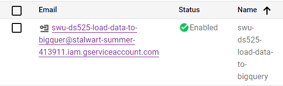
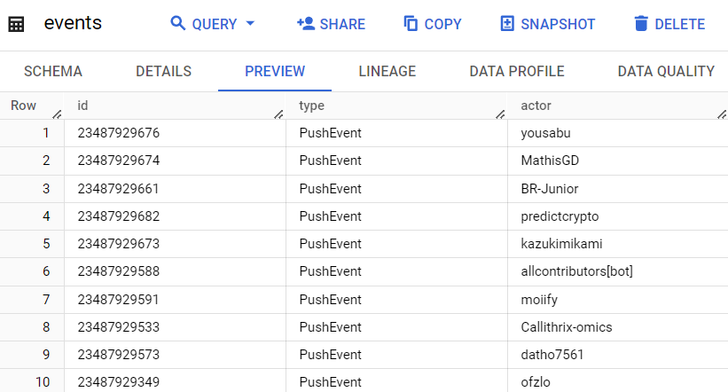

# Instruction 

## Create Virtual Environment

```sh
python -m venv ENV
source ENV/bin/activate
pip install -r requirements.txt
```

## Install packages from requirement.txt

```sh
pip install -r requirements.txt
```

## Install Google Cloud Python libraries

```sh
pip install google-cloud-bigquery google-auth
```

## Run ETL Script

```sh
python etl.py
```

# Documentation

## Configuration ETL Script for Bigquerry

### Credetials
- upload **credential file** which received from creating service account on bigquerry



### ETL script
- update keyfile from path in folder credentials
```sh 
"../credentials/stalwart-summer-413911-swu-ds525-load-data-to-bigquer-70a5d392516f.json"
```

- update project_id (name the dataset project from bigquerry)
```sh 
"stalwart-summer-413911"
```

- update schema "actor" for the events table
```sh 
    job_config = bigquery.LoadJobConfig(
        skip_leading_rows=1, # skip header
        write_disposition=bigquery.WriteDisposition.WRITE_TRUNCATE, # truncate = replace
        source_format=bigquery.SourceFormat.CSV,
        schema=[
            bigquery.SchemaField("id", bigquery.SqlTypeNames.STRING),
            bigquery.SchemaField("type", bigquery.SqlTypeNames.STRING),
            bigquery.SchemaField("actor", bigquery.SqlTypeNames.STRING),
        ],
    )
```

- update table including new column
```sh 
 with open("github_events.csv", "w") as csv_file:
        writer = csv.writer(csv_file)
        writer.writerow(["id", 
                         "type", 
                         "login",
        ])
```

- update extracting data including new column
```sh 
for datafile in all_files:
            with open(datafile, "r") as f:
                data = json.loads(f.read())
                for each in data:
                    writer.writerow([
                        each["id"], 
                        each["type"],
                        each["actor"]["login"],
                    ])
```

